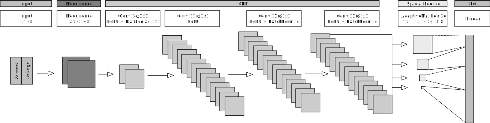

# RPSPP: Recurrence Plot Spacial Pyramid Pooling Network for Appliance Identification in Non-Intrusive Load Monitoring

Implementation of high sample rate appliance identification using recurrence plots and a spacial pyramid pooling neural network.

A parameter free appliance identification algorithm for NILM using a 2D
representation of time series known as unthresholded Recurrence
Plots (RP) for appliance category identification. One cycle of
voltage and current (V-I trajectory) are transformed into a RP
and classified using a Spacial Pyramid Pooling Convolutional
Neural Network architecture. The performance of this approach
is evaluated on the three public datasets COOLL, PLAID and
WHITEDv1.1.

The full publication can be found here: [Parameter_Free_Recurrence_Plots.pdf](Parameter_Free_Recurrence_Plots.pdf)

## Preprocessing
1. Voltage-Current Zero Crossing Alignment
3. Select one cycle
4. Piecewise Aggregate Approximation (PAA)

## Network Architecture


```
----------------------------------------------------------------
        Layer (type)               Output Shape         Param #
================================================================
   RecurrenceLayer-1        [-1, 1, 2000, 2000]               0
   RecurrenceLayer-2        [-1, 1, 2000, 2000]               0
         MaxPool2d-3          [-1, 2, 200, 400]               0
            Conv2d-4          [-1, 2, 200, 400]              38
              ReLU-5          [-1, 2, 200, 400]               0
         MaxPool2d-6           [-1, 2, 66, 133]               0
            Conv2d-7          [-1, 32, 66, 133]             608
              ReLU-8          [-1, 32, 66, 133]               0
            Conv2d-9          [-1, 32, 66, 133]           9,248
             ReLU-10          [-1, 32, 66, 133]               0
      BatchNorm2d-11          [-1, 32, 66, 133]              64
           Conv2d-12          [-1, 32, 66, 133]           9,248
             ReLU-13          [-1, 32, 66, 133]               0
      BatchNorm2d-14          [-1, 32, 66, 133]              64
           Linear-15                    [-1, 9]          24,489
================================================================
Total params: 43,759
Trainable params: 43,759
Non-trainable params: 0
----------------------------------------------------------------
Input size (MB): 0.02
Forward/backward pass size (MB): 81.98
Params size (MB): 0.17
Estimated Total Size (MB): 82.16
----------------------------------------------------------------
```

## Requirements

Software is only tested on Linux using an NVIDIA GPU.


```
pip install -r requirements.txt
```

## Datasets
* [COOLL](https://coolldataset.github.io/)
* [PLAID 2017](https://figshare.com/articles/dataset/PLAID_2017/11605215)
* [WHITEDv1.1](https://www.in.tum.de/en/i13/resources/whited/)

### COOLL Structure
Argument: ```--cooll-path```

The expected directory structure:
```
- configs
 |- scenario1_1.txt
 |- scenario1_2.txt
 |- ...
- data
 |- scenarioC1_1.flac
 |- scenarioV1_1.flac
 |- ...
- appliances_and_action_delays.txt
```

### PLAID Structure
Argument: ```--plaid-path```

The expected directory structure:
```
- CSV
 |- 1.csv
 |- 2.csv
 |- ...
- meta_2017.json
```

### WHITED Structure
Argument: ```--whited-path```

The expected directory structure:
```
- AC_Electrolux_r5_MK2_20151031065948.flac
- AC_Electrolux_r5_MK2_20151031070257.flac
- ...
```

## Usage
```
python -m rpspp --cooll-path=<path-to-dataset>
```

Multiple dataset path can be passed

```
python -m rpspp --cooll-path=<path-to-dataset> --plaid-path=<path-to-dataset>
```

## Run as Docker container
Create .env file
```
LOG_PATH=/host/path/logs/
COOLL_PATH=/host/path/logs/cooll
PLAID_PATH=/host/path/logs/plaid
WHITED_PATH=/host/path/logs/whited
```

Build images
```
docker-compose build
```

Run RPSPP experiments for all datasets
```
docker-compose up rpspp
```

Run WRG experiments for all datasets
```
docker-compose up wrg
```


## Results
### Leave One Group Out

|Algorithm|COOLL|WHITED|PLAID|
|---|---|---|---|
| De Baets et al.** | N/A  | **0.7546** | 0.7760 |
| WRG (our result) | 0.4447 | 0.3954 | 0.8921 |
| RPSPP | **0.5329** |  0.4310  | **0.8942** |
** De Beats results are as published by the authors
### 5-Fold
|Algorithm|COOLL|WHITED|PLAID|
|---|---|---|---|
| WRG (our result) | 0.8957 | **0.9984** | 0.8082 |
| RPSPP | **0.9213** |  0.9924  | **0.8456** |


## Citation
Please cite this work as:

```
@inproceedings{RPSPP_2021,
  author = {Wenninger, Marc and Bayerl, Sebastian P. and Maier, Andreas and Schmidt, Jochen},
  title = {Recurrence Plot Spacial Pyramid Pooling Network for Appliance Identification in Non-Intrusive Load Monitoring},
  booktitle = {20th IEEE International Conference on Machine Learning and Applications - ICMLA 2021},
  year = {2021},
}
```